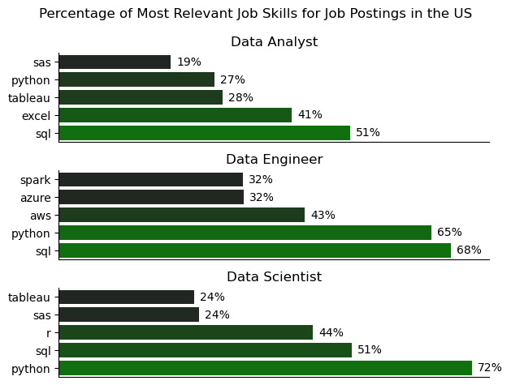
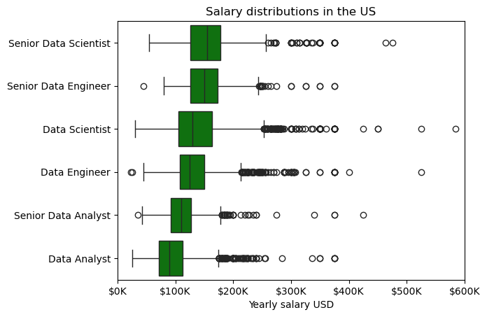
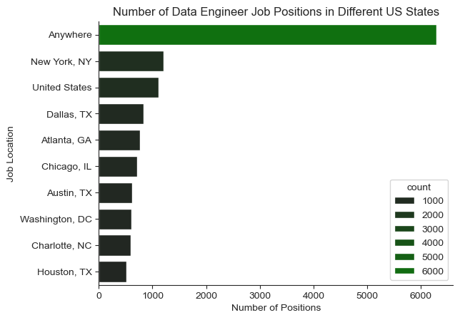
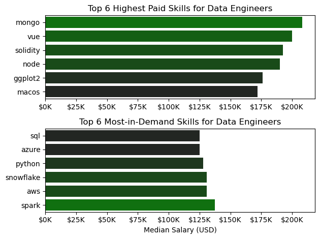
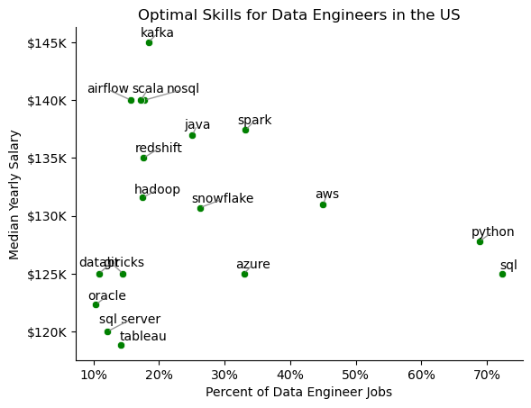
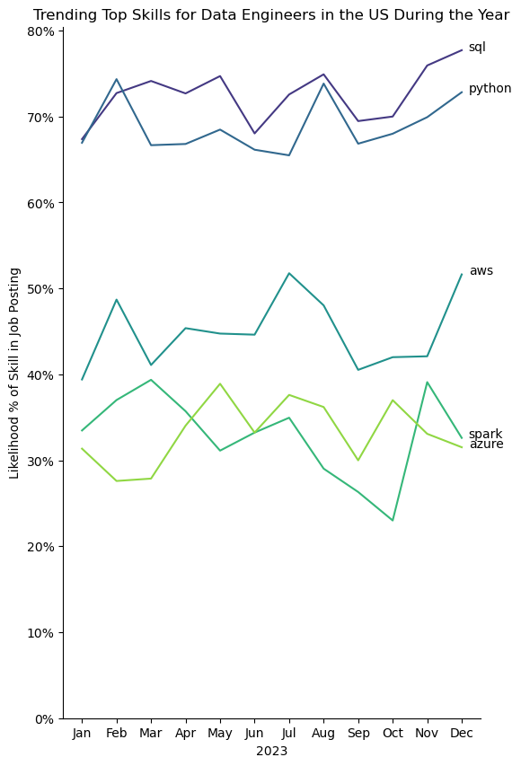

# General information and overview

## General info
Before I get into presenting my project, I have to preface that I was following Luke Barousse's tutorial when coding this python project for my CV. I don't know this code by heart because I just recently picked up python and I don't remember all the functions by heart, but I can explain 95% of what the code does and the philosophy behind why those choices were made.

## Overview
Following [Luke Barousse's Python Course](https://lukebarousse.com/python) and using his provided dataset with data related field job postings, salaries, locations and skills I analyzed the data with various python scripts and libraries like pandas, seaborn, matplotlib. I uploaded this to GitHub and everything was done in VScode and jupyter. 

I wanted to answer similar (but modified) questions that were tackled in the course: 

### General trends for Data-Related Job Fields
1) What were the most relevant skills for Data Analysts, Data Engineers and Data Scientists?
2) What are the highest paying salaries for different Data-Related Job Fields?

### Zooming in on the trends for Data Engineers
3) What were the US states with the most Data Engineering jobs?
4) What are the highest paid skills vs the most in demand skills for Data Engineers?
5)  What are the optimal skills compared to the median salary for Data Engineers?
6) What are the skills that show up the most for Data Engineer job postings throughout the year?


# The Analysis

## 1. What were the most relevant skills for Data Analysts, Data Engineers and Data Scientists?


### Notebook link
1st question Notebook link for detailed code: [Relevant skills](1_percent_relevant_skill.ipynb)


### Code

```python
#plotting the horizontal barplot
fig, ax = plt.subplots(len(job_titles),1)
for i, job_title in enumerate(job_titles):
    df_plot = dfpercent[dfpercent['job_title_short']==job_title].head(5) 
    sns.barplot(data=df_plot, x='skill_percent',y='job_skills', ax=ax[i], hue='skill_count', palette='dark:g')
    #alot of formatting
    ax[i].invert_yaxis()
    ax[i].set_title(job_title)
    ax[i].set_ylabel('')
    ax[i].set_xlabel('')
    ax[i].set_xlim(0, 75)
    ax[i].legend().set_visible(False)
    
    #this code for putting clean percentages on the bar plot, could never write myself, followed tutorial
    for n, v in enumerate(df_plot['skill_percent']):
            ax[i].text(v+1, n, f'{v:.0f}%', va='center')
                
    ax[i].set_xticks([])
sns.despine()
fig.suptitle('Percentage of Most Relevant Job Skills for Job Postings in the US')
fig.tight_layout()
plt.show()
```

### Results


### Explanation
As we can see from the graph, the highest requested programs that you need to know for all data-related job fields are SQL and python (except data analyst, they don't need python that much). It seems that tableau and excel are more important for analysts because they either might be working with smaller datasets or just need good visualization options (hence, tableau). Data scientists are more valued for their knowledge of R, sql and python, thats probably because they have to extract valuable insights from big datasets. Lastly, if you want to become a data engineer - you need to learn cloud platforms like azure or aws.

## 2. What are the highest paying salaries for different Data-Related Job Fields?
### Notebook link
2nd question Notebook link for detailed code: [Salary analysis](2_salary_analysis.ipynb)

### Code
```python 
#plot the boxplot
sns.boxplot(data=df_us_top6, x='salary_year_avg', y='job_title_short', order=joborder_list)

#formatting
plt.title('Salary distributions in the US')
plt.xlabel('Yearly salary USD')
plt.ylabel('')
plt.xlim(0, 600000)
ticks_x=plt.FuncFormatter(lambda y, pos: f'${int(y/1000)}K')
plt.gca().xaxis.set_major_formatter(ticks_x)
plt.show()
```

### Results



### Explanation
I am not a fan of boxplots personally, but this graph actually provides valuable info so I did it anyway. It shows that the biggest salary are for senior roles, which is to be expected, however some outliers especially in the data scientist area are fascinating, because their yearly salry is bigger than the salary that the senior positions get. So if you become a data scientist and get really lucky its really worth it! Combining with info from the previous graph, it seems that knowing R, python and sql all together might be really really worth it.
## 3. What were the US states with the most Data Engineering jobs?
### Notebook link
3rd question Notebook link for detailed code: [Geographic location of data engineering jobs](3_num_of_jobs_geo.ipynb)
### Results




### Explanation
I skipped the code for this one, because it was pretty simple. What I wanted to say is that simple is not bad and being simple is very important when presenting insights to stakeholders or people who are not data-analysis-savvy. So this is a simple graph showing that most Data Engineer positions are available anywhere in the US, more precisely, they are available as work from home job offers. It seems that the dataset has 'United States' listed as a more specific state but it probably meant to mean that it is also work from home/anywhere in the US. The lesson here is that thats a future thing to debug for accurate and good visualization. The ones that follow after are NY and Chicago.

## 4. What are the highest paid skills vs the most in demand skills for Data Engineers?

### Notebook link
4th question Notebook link for detailed code: [Highest paid skills and highest in demand skills](4_paid_and_demanded_skills.ipynb)

### Code
```python
#graph for top 6 paid skills and top 6 most in demand skills for data engineers
fig, ax = plt.subplots(2, 1)

#barplot construction and formatting
sns.barplot(data=df_DE_biggestsalary, x='median', y=df_DE_biggestsalary.index, ax=ax[0], legend=False, hue='median', palette='dark:g')
ax[0].invert_yaxis
ax[0].set_title('Top 6 Highest Paid Skills for Data Engineers')
ax[0].set_ylabel('')
ax[0].set_xlabel('')
ax[0].xaxis.set_major_formatter(plt.FuncFormatter(lambda x,_:f'${int(x/1000)}K'))

#second barplot construction and formatting
sns.barplot(data=df_DE_wantedskills, x='median', y=df_DE_wantedskills.index, ax=ax[1], legend=False, hue='median', palette='dark:g')
ax[1].invert_yaxis
ax[1].set_title('Top 6 Most-in-Demand Skills for Data Engineers')
ax[1].set_ylabel('')
ax[1].set_xlabel('Median Salary (USD)')
ax[1].xaxis.set_major_formatter(plt.FuncFormatter(lambda x,_:f'${int(x/1000)}K'))
ax[1].set_xlim(ax[0].get_xlim())


fig.tight_layout()
```

### Results


### Explanation
This combined barplot is a bit of a weird one. IT shows that the highest paid skills for Data engineers are mongo and vue followed by solidity. Since when are data engineers also in charge of front end UI? I have no cllue but thats what vue is for. Mongo is a nosql database and maybe learning how to operate a more nieche database like that can be very valuable as we can see from this graph. Solidity is used for blockchain technologies and looks very new, so it might be a worthwhile investment.

## 5.  What are the most optimal skills compared to the median salary for Data Engineers?

### Notebook link
5th question Notebook link for detailed code: [Scatterplot for optimal skills](5_scatterplot_optimal_skills.ipynb)

### Code
``` python 
#explode out the job skills (now there is more rows and I previously made the mistake of counting the rows of the exploded dataframe and got incorrect values)
df_DE_US=df_DE_US.explode('job_skills')

#with aggregate count the median salary and the count for each job skill for data engineers and sort them values
df_DE_US[['salary_year_avg','job_skills']]

df_DE_US_grouped=df_DE_US.groupby('job_skills')['salary_year_avg'].agg(['count','median']).sort_values(by='count', ascending=False)

#formula for counting the skill percent that appears in Data Engineer job postings, the skill percent is adjusted so the scatterplot doesnt look too crowded, the optimal number that I chose was 10
df_DE_US_grouped['skill_percent'] = df_DE_US_grouped['count'] / DE_job_count*100

skill_percent = 10

DE_highdemand_skills = df_DE_US_grouped[df_DE_US_grouped['skill_percent']>skill_percent]
```

### Results



### Explanation
The 5th plot is an optimal skills scatterplot and this one gave me a lot of trouble with the formatting and I couldn't even fix it in the end. Previously, airflow scala and nosql overlapped, but when I fixed that, databricks and git decided to overlap and no matter what solutions I tried (yes, I asked chatGPT), nothing good came up that didn't require adding every single name manually and I didnt want to add that.

The scatterplot itself says that knowing sql and python is required for most data engineer jobs, while if you want a bigger salary - learn nosql, airflow, scala or kafka. It seems that learning how to be a full stack data engineer (if thats even a thing) is very valuable in the job market!


## 6. What are the skills that show up the most for Data Engineer job postings throughout the year?

### Notebook link
6th question Notebook link for detailed code: [Trending skills lineplot](6_trendingskills_lineplot.ipynb)

### Code
``` python
#get only first/biggest 5 values of the jobskills/No.ofpostingseverymonth dataframe
DE_US_plot=DE_US_percent.iloc[:, :5]
fig, ax = plt.subplots(figsize=(6,10))
sns.lineplot(data=DE_US_plot, dashes=False, palette="viridis", ax=ax)

#alot of formatting, like wow
sns.despine()
plt.title("Trending Top Skills for Data Engineers in the US During the Year")
plt.ylabel('Likelihood % of Skill in Job Posting')
plt.xlabel('2023')
plt.legend().remove()
ax.set_ylim(bottom=0)

#more formatting (i did this by following the course)
from matplotlib.ticker import PercentFormatter
ax.yaxis.set_major_formatter(PercentFormatter(decimals=0))
for i in range(5):
    plt.text(11.2, DE_US_plot.iloc[-1,i], DE_US_plot.columns[i])

plt.show()
```

### Results



### Explanation

Lastly, another graph I had trouble with. It is streched because no matter how I'd format it, the spark and azure text would always overlap. The trend remains the same and is mostly everything we've seen before for Data Engineer job positions - this time we are looking at it from a time perspective and for some reason there seems to be a general trend of more recruitments for data engineers especially in July (thats when im applying too wow!). All of the skills in the graph follow a similar trend (except Spark) and it seems that SQL and Python are the most requested ones yet again, so everyone trying to land a data-related job should learn those.


# Problems and final thoughts
## Final thoughts
As we could see from the analysis, Data Engineers can pretty much work from anywhere if they have the skills. The most relevant skills are spark for data processing and other cloud software like aws and snowflake. The highest paid skills mongo, vue and solidity. In spite of them being the highest paying skills, the next graph shows us that there are very little job offerings which require those skills. The ones that do pay a lot more than basic skills like sql and python that are common and show up at least 15-20% of the time in job postings are scala, nosql, airflow and kafka. Lastly, from the way that the skills are trending for data engineers during the year, we can see that theres a surge for data engineers during July and another surge at November and December, at the end of the year, instead of at the start like we would assume.
## Problems
The main problem that I faced with this analysis is that the visualization customization is very difficult and doesn't feel natural or intuitive - it feels really clunky. I would much rather use my smaller final filtered dataframe thats ready for visualization and export it to excel where it would be easier, or use tableau or google looker studio to make it more visually appealing and tidy, because now some formatting issues make the visualizations good, but not perfect.

Flipping, merging, sorting and counting values in dataframes feels pretty intuitive and I would say that those things are really pythons main strength. Especially when working with big datasets, excel feels clunky, but python feels like its just doing the job for you.

In conclusion, this was a great learning experience and I learned a lot about Python and brushed up my skills of analyzing data while doing this course. 